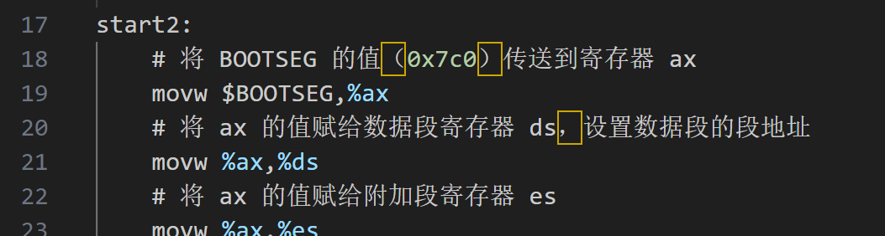

# 单步调试手段

　　对于代码来说，最好的学习手段就是单步。尤其是对于汇编这种。但是作者并没有提到单步的方法。笔者经过近两周的摸索，终于实现了最初单步汇编的想法。这里记录下来，方便大家使用。

# 平台

　　作者在书里面介绍了两种仿真平台：bochs和qemu。笔者最开始使用的是qemu进行单步。也就是使用最常见的`-s -S`​参数，但是遇到的问题一直没有解决。包括设置大小端，设置架构的等，最终都无法按照预期单步到bootsect等汇编代码里面，猜想可能是因为cpu类型的原因。受限于当前的知识水平，虽然经过各种努力，但是一直失败，最终也没有找到解决方法。

　　于是转战到bochs，最终实现了。这里面也有一些波折。

　　首先，ubuntu自动安装的是2.7的版本，如下所示：

```这个版本里面，没有VGA的image，也没有作者提到的dxlinux文件夹下的bochsrc.bxrc文件。最终是没有使用ubuntu
root@LAPTOP-C1A0RFI9:/usr# bochs -v
00000000000i[      ] LTDL_LIBRARY_PATH not set. using compile time default '/usr/lib/x86_64-linux-gnu/bochs/plugins'
========================================================================
                        Bochs x86 Emulator 2.7
              Built from SVN snapshot on August  1, 2021
                Timestamp: Sun Aug  1 10:07:00 CEST 2021
========================================================================
```

　　这个版本里面，没有VGA的image，也没有作者提到的dxlinux文件夹下的bochsrc.bxrc文件。最终是没有使用ubuntu apt安装的bochs版本，而是自己下载了3.0的版本进行安装使用。3.0版本的安装命令如下所示：

```c
wget https://sourceforge.net/projects/bochs/files/bochs/3.0/bochs-3.0.tar.gz/download -O bochs-3.0.tar.gz
tar -zvxf bochs-3.0.tar.gz
cd bochs-3.0/
./configure --enable-debugger
make
make install
```

　　笔者这里直接将tar.gz文件放到doc目录下了，大家可以按需取用。

# bochs使用

　　配置文件: bochsrc.bxrc，内容如下：

```这个版本里面，没有VGA的image，也没有作者提到的dxlinux文件夹下的bochsrc.bxrc文件。最终是没有使用ubuntu
###############################################################
# bochsrc.txt file for DLX Linux disk image.
###############################################################

# how much memory the emulated machine will have
megs: 32

# filename of ROM images
romimage: file=$BXSHARE/BIOS-bochs-latest
vgaromimage: file=$BXSHARE/VGABIOS-lgpl-latest.bin

boot: floppy

# what disk images will be used 
floppya: 1_44=linux.img, status=inserted
floppyb: 1_44=floppyb.img, status=inserted

# hard disk
# ata0: enabled=1, ioaddr1=0x1f0, ioaddr2=0x3f0, irq=14
# ata0-master: type=disk, path="hd10meg.img", cylinders=306, heads=4, spt=17

# choose the boot disk.
# disasm: intel=0


# default config interface is textconfig.
#config_interface: textconfig
#config_interface: wx

#display_library: x
# other choices: win32 sdl wx carbon amigaos beos macintosh nogui rfb term svga

# where do we send log messages?
log: bochsout.txt

# disable the mouse, since DLX is text only
mouse: enabled=0

# set up IPS value and clock sync
cpu: ips=15000000
clock: sync=both

# enable key mapping, using US layout as default.
#
# NOTE: In Bochs 1.4, keyboard mapping is only 100% implemented on X windows.
# However, the key mapping tables are used in the paste function, so 
# in the DLX Linux example I'm enabling keyboard_mapping so that paste 
# will work.  Cut&Paste is currently implemented on win32 and X windows only.

# keyboard: keymap=../keymaps/x11-pc-us.map
#keyboard: keymap=../keymaps/x11-pc-fr.map
#keyboard: keymap=../keymaps/x11-pc-de.map
#keyboard: keymap=../keymaps/x11-pc-es.map

```

　　该文件笔者也会放到doc目录下。

　　仿真执行：`bochs -f bochsrc.bxrc`​

　　单步执行：`bochs -f bochsrc.bxrc -debugger`​

　　单步执行的具体介绍如下，启动后，首先打断点，再执行c指令，具体如下：

　　​​

　　但是这里有一个问题，汇编显示的风格是intel风格的，作者的示例代码是AT&T风格的，需要切换风格。具体如下：

　　​

　　这样就和代码对的上了。

　　​​

　　‍
